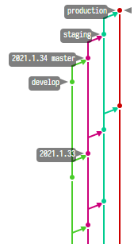

DMSPFlow
====

简单的，基于四个主要分支的分支管理方法

## 概述

通常开发的过程，一般是开发、测试，最后发布生产。一般在团队开发时，为了避免代码随意提交扰乱他人开发节奏的情况，会独立出一个多人或多功能共享的源分支。比如有两个功能分支 feat/1、feat/2 和 master。但是在大多数情况下，一般一个团队或一个项目，只需要一个共用的开发分支。所以，本方法定义 develop、master、staging、production 四个主要分支管理代码。四个分支分别代表开发过程中的四个环境。

**develop**

develop 分支主要用于日常开发，对应开发环境。

**master**

master 分支作为核心分支，作为其他分支的来源分支。staging 分支和 production 分支都直接来自 master 分支。

**staging** 和 **production**

staging 分支和 production 分支，分别对应测试环境和生产环境。作为环境的发布分支。所有的修改都不允许基于这两个分支开发。

除了以上的四个主要分支外，还定义了 hotfix 分支。主要用于做生产的临时修复。

## 为什么不是

### Git Flow

Git Flow 产生的环境不是当下这种，以 Web 为主，DevOps 快速集成的环境。Git Flow 定义的以功能为主，按版本发布的情况，更适合类似早期的 C/S 类似软件，或类似 Spring 这类大型框架项目。这些工程、项目的一个特点是，生产环境会存在多个分支版本。比如 Spring 发布的 Release 版本存在 4.x.x.RELEASE 和 5.x.x.RELEASE。两个生产版本在一定时间内，必须要有对应的维护（修补）。所以需要两个代码分支同时存在，并且某些代码需要同时集成到两个分支。而对于现在这种，以网络环境为主，B/S 架构的软件情况下，多数情况都是只有一个生产版本，并且进行一条主线的持续集成。此时，Git Flow 就显得非常负责，和冗余。

### Github Flow 或 Gitlab Flow

Github Flow 和 Gitlab Flow 是类似的操作流程，这两个流程以 master 分支为主力分支，作为发布和集成的核心。在流程的定义中，没有明确区分各软件环境对应的分支。如果按 master 作为生产分支，测试分支由个功能分支来实施的话，则需要额外定义流程规范。否则，依然容易造成分支管理混乱。

## 引用

1. http://www.ruanyifeng.com/blog/2015/12/git-workflow.html
1. https://nvie.com/posts/a-successful-git-branching-model/
