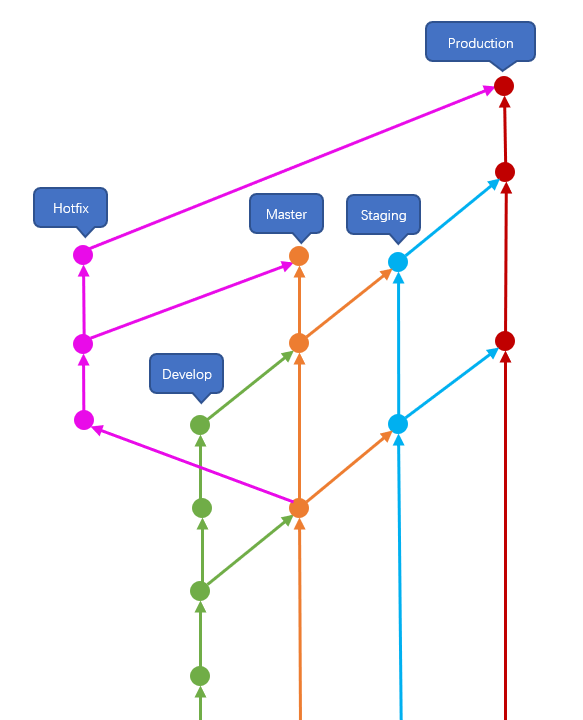
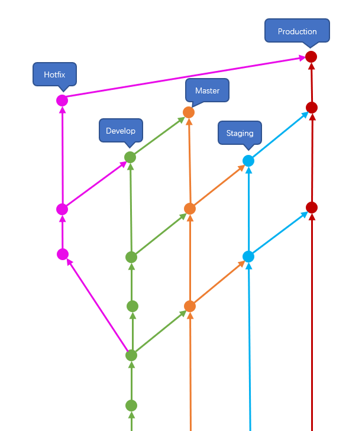

DMSPFlow
====

简单的，基于四个主要分支的分支管理方法

## 概述

通常的软件工程，一般会经过开发、测试，最后发布生产三个阶段。团队在开发时，一般会按照功能拆分分支，或按个人拆分分支。但是在大多数情况下，一般一个团队或一个项目，只需要一个共用的开发分支。所以，本方法定义 develop、master、staging、production 四个主要分支管理代码。四个分支分别代表开发过程中的四个环境。

## develop

develop 分支主要用于日常开发，对应开发环境。

1. 如果不需要对功能的开发进行隔离和拆分的，所有开发人员可以都在该分支上进行开发。
1. 在这个分支上，只要不会扰乱其他在本分支上开发的开发人员。那么，这个分支几乎允许一切行为。例如随时进行回退（当然不会回退超过 master 分支），或者任意提交不稳定的代码等。

让团队的开发人员在一个分支上开发，是有好处的。当然，前提是小型团队。它可以让团队不需要拘泥于分支的切换、管理和操作上。各个功能在开发时，遇到需要共享的通用代码时，也不需要思考额外的方案来共享它们。另外，由于多人同一分支开发，也可以尽早的发现不稳定代码。提高代码健壮性，简介提高代码可读性等。省去了一部分代码审核（review）的工作。

## master

master 分支作为核心分支，作为其他分支的来源分支。staging 分支和 production 分支都直接来自 master 分支。

develop 分支只有最初来自 master 分支。之后，develop 将作为 master 的来源。如果项目足够简单，团队成员水准一致，那么可以省略 develop 分支。直接将 master 作为 develop 分支。但是这么做，会要求所有提交的代码，必须要足够稳定。它不能像单纯的 develop 分支那样无拘无束。这么简单的要求，那为什么还需额外独立 develop 分支呢？主要是为了对代码增加可控的审核机制。

为了保证 master 代码的质量，master 分支不允许 Owner 和 Maintainer 之外的人提交代码。而非 master 分支之外的所有分支，即使是测试和生产环境也是如此，都可以由团队内成员任意提交。

这么做可以

1. 因为测试和生产环境被定义为 master 的下游。所以，即使成员可以随意提交代码。一旦代码需要更新，都可以使用 master 随意覆盖测试和生产环境；
1. 所有需要提交到 master 的代码，被强制需要由 Owner 或 Maintainer 成员合并或者提交。这样可以让 Owner 和 Maintainer 成员能被主动告知代码变动，并进行代码审核。

## staging 和 production

staging 分支和 production 分支，分别对应测试环境和生产环境。这两个分支作为环境的发布分支。可以视为 master 上对应代码的拷贝，或者对应节点的引用。因此，不允许直接在这两个分支提交代码。

一般来说，对测试环境的改动，一般是修复开发时期产生的 Bug 或功能缺陷。在测试环境的上游代码修改修复才是正确的选择。直接对测试环境的代码进行改动，反而是不明智的。因为如果这么修改，你还需要将相同的代码想办法同步到开发环境。

对生产环境来说。改动除了发布新功能以外，就是临时的 Bug 修复。一般这种 Bug 的紧急度都非常高，要求立即对生产进行应用。否则一般都会等到下次功能发布，一并发布修复。所以，正常的话，生产环境不会直接提交任何代码。对于紧急的 Bug 修复，和测试环境相同。如果直接在生产环境修改，之后再将代码反向同步到开发环境。反而会增加麻烦。

保持 staging 分支和 production 分支不直接提交代码，可以让这两个分支始终都保持纯净。这样做，可以让管理人员或开发人员，随意的覆盖它们。

## hotfix

修复紧急 Bug 可以查找，develop 分支或 master 分支上生产发布的 commit。签出独立的 hotfix 分支进行修改。

> master 签出

> develop 签出

hotfix 分支是从 develop 签出还是从 master 签出，逻辑和 master 的描述中有关省略 develop 的逻辑类似。如果除了 develop 还有别的开发分支，可能更偏向于使用 master 签出。

## tag

因为不允许直接提交 production 分支，所以对于 hotfix 来说。追溯和查找 production 发布的开发 commit 就是比较困难的事情。所以，为了便于追溯和查找。在每次发布 production 的时候，都为发布的最终 commit 添加 tag。因为 staging 和 production 都不包含主要内容，或者如 hotfix 节所说。签出是在从 master 和 develop 签出的。所以，自然在 master 和 develop 分支上进行 tag 操作时最好的。

### Calendar Versioning

以现在业界更加敏捷的趋势来看，发布将会越来越密集。所以如果单纯的数字递增的方式生成版本号。一来会丢失一些信息，查找起来不方便。二来大量的无意义数字，看起来就很难于辨认。所以，统一使用日期做版本号，会是一个不错的选择。可以根据发布的频繁程度，可以自行选择按年、按月、按周进行递增。

## 退化

对于需要多功能隔离开发的情况，单个、共享的开发分支显然不支持。所以在这种情况下，可以自行进行其他选择。比如规范严谨的 Git Flow。

## 为什么不是

### Git Flow

Git Flow 产生的环境不是当下这种，以 Web 为主，DevOps 快速集成的环境。Git Flow 定义的以功能为主，按版本发布的情况，更适合类似早期的 C/S 类似软件，或类似 Spring 这类大型框架项目。这些工程、项目的一个特点是，生产环境会存在多个分支版本。比如 Spring 发布的 Release 版本存在 4.x.x.RELEASE 和 5.x.x.RELEASE。两个生产版本在一定时间内，必须要有对应的维护（修补）。所以需要两个代码分支同时存在，并且某些代码需要同时集成到两个分支。而对于现在这种，以网络环境为主，B/S 架构的软件情况下，多数情况都是只有一个生产版本，并且进行一条主线的持续集成。此时，Git Flow 就显得非常负责，和冗余。

### Github Flow 或 Gitlab Flow

Github Flow 和 Gitlab Flow 是类似的操作流程，这两个流程以 master 分支为主力分支，作为发布和集成的核心。在流程的定义中，没有明确区分各软件环境对应的分支。如果按 master 作为生产分支，测试分支由个功能分支来实施的话，则需要额外定义流程规范。否则，依然容易造成分支管理混乱。

## 引用

1. 《Git 工作流程》http://www.ruanyifeng.com/blog/2015/12/git-workflow.html
1. 《A successful Git branching model》https://nvie.com/posts/a-successful-git-branching-model/
1. 《日历化版本 / Calendar Versioning》https://calver.org/overview_zhcn.html
